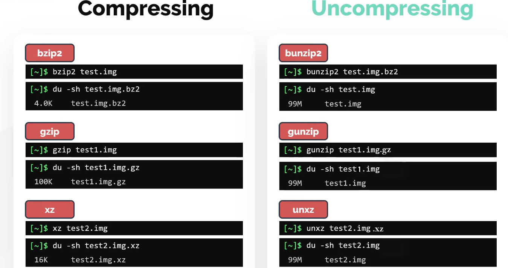

## Compressing, Decompressing, Archieving , Extracting

#### Check File Sizes
```bash
$ du -sk image.png # shows file size in kb
$ du -sh image.png # shows file size in human readable form
$ ls -sk image.png # shows size in details
```
## TAR (Tape Archieve)
    - used to archieve multiple files into one
    - file obtained from tar compression is known as tarball
```bash
$ tar -cf test.tar file1 file2 file3 # Archieves these 3 files into test.tar
$ ls -ltr test.tar

$ tar -tf test.tar # to review the content inside tar before extracting it
$ tar -xf test.tar # to extract test.tar
$ tar -zcf test.tar file1 file2 # to compress the tar and reduce the size

```

```bash 
# To read the compressed file without decompressing them we can use tools like, zcat/bzcat/xzcat
$ zcat hostfile.txt.bx2
```
