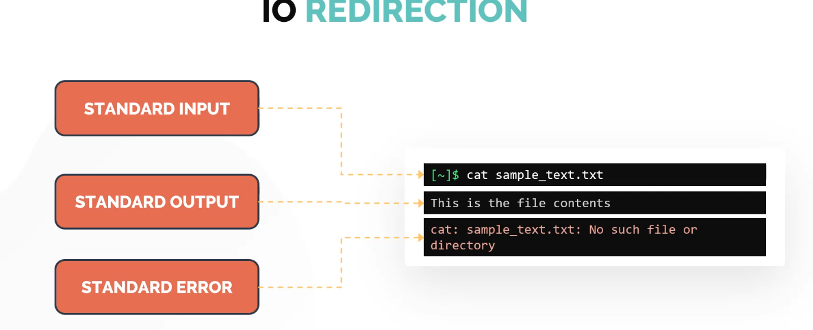

## IO Redirection


## Redirect Standard Output
    - '>' this is called redirection sign
    - to write only output to a file use >
    - to append only output to a file use >>
```bash
$ echo "hello" > out.txt # to write the std out
$ echo "My name is Neesh" >> out.txt # to append the std out
```
## Redirect Standard error
    - to write only errors to a file use 2>
    - to append only errors to a file use 2>>
```bash
$ cat hello.py 2> error.txt # to write the std out
$ pyton3 hello.py 2>> error.txt # to append the std out
```
## Command Line PIPES
    - First command standart out is used as standard in for second command
    - '|' this is pipe character 

```bash
$ apt list | grep "firefox"
$ grep Hello sample.txt | less

```
#### Tee command
The tee command in Linux (and other Unix-like systems) is a powerful utility that allows you to simultaneously display output on the standard output (your terminal) and save it to one or more files.

Think of it like a "T" pipe fitting in plumbing – it splits the flow of data.
It can perform redirection but display out over the screen as well.
```bash
$ echo $SHELL | tee shell.txt # to write and display
$ echo $HOME | tee -a shell.txt # to append and display
```