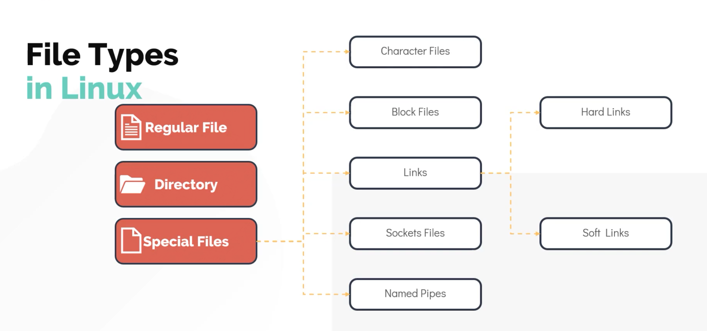

## File Types In Linux
``` Everything in Linux is a file```




```
Note: A Note about filesystems Hierarchy in Linux

/home -> location that contains home directory for all users except root user.
         root user data resides at /root

/opt -> to install any 3rd part application ( ideal to install any webapp)

/mnt -> temporary mount (iserd to mount file sustem temporarily)

/media -> usb drives ( all external media is moundted here)

/dev -> contains special block devise and character files . store info for external hardisk, mouse, keyboard.

/bin -> basic commands (mkdir, mv ..)/ binaries lives here

/etc -> here most of configuration files are stored

/lib -> look here for shared library to import into program

/usr -> all user land app and their data lives here

/var -> have all the logs/cached data, in case of troubleshooting check logs here.
```
```bash
$ file # list all file types
$ df -hp # prints info of all mounted file system
$ sudo file /root/firefox.deb # type of file is firefox.deb located at /root
```