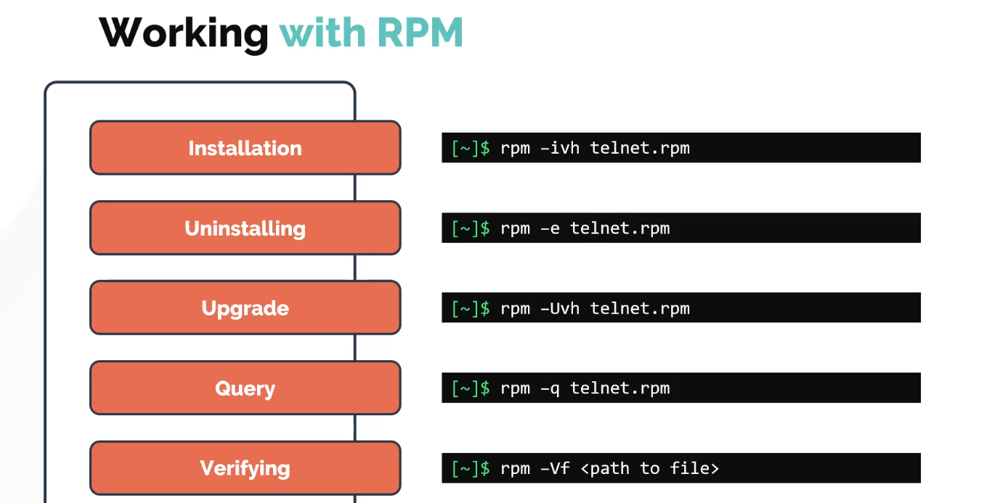
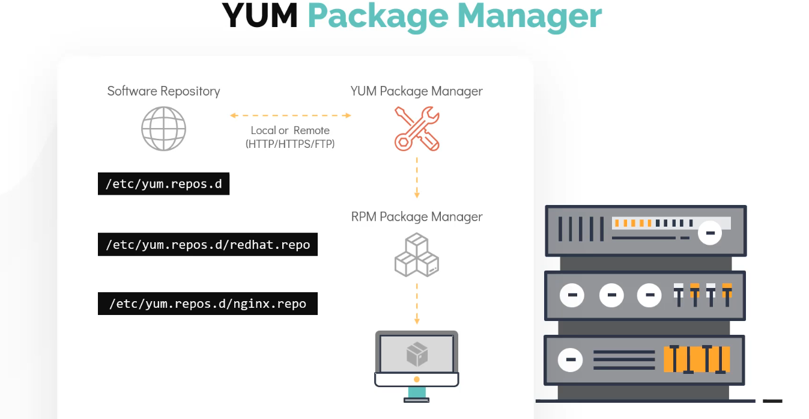
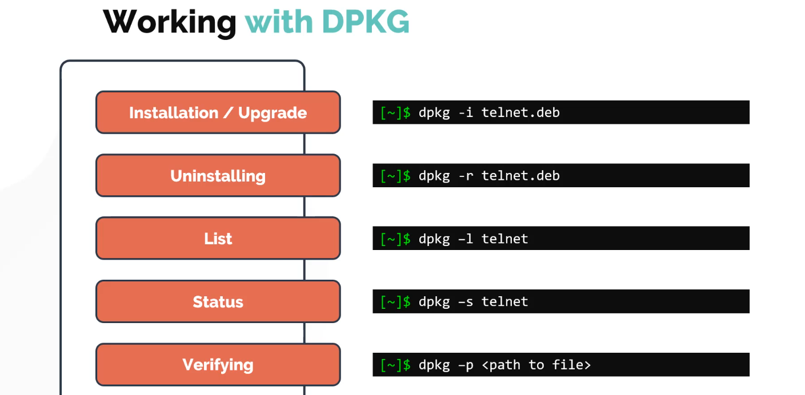
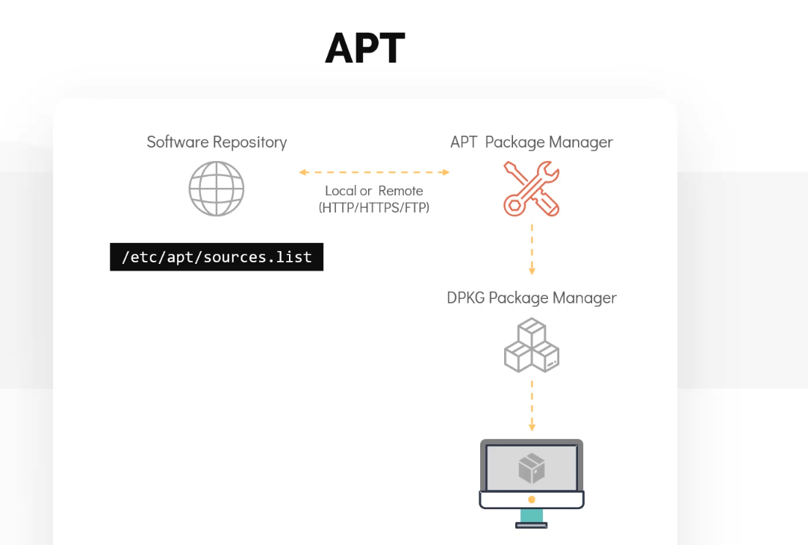

## Package Management In Linux
```bash
# There are mostly 2 types of linux distro categorization based on package managers
# 1. Rpm based(RHEL, CentOS, Fedora)
# 2. debian based( Ubuntu, Debian, Linux Mint)

# Different package manager in linux - DPKG, APT, APT-GET, RPM, YUM, DNF

```
## Redhat Package manager(RPM)


## Yellowdot Update Modify Package Manager (YUM)
 - Works with RPM Based distros
 - High level package manager which does automatic dependency resolution
 - software repos

```bash

$ yum repolist # will show all repolist added to system
$ yum provides scp 
$ yum install httpd # to install a package
$ yum remove httpd # to uninstall 
$ yum update telnet # to update a package
$ yum update # will check and update all packages
```
## DPKG ( Debian based Package manager)

 - Similar to rpm, dpkg does not honour dependecy management so we need apt or apt-get here.

## APT (Advance package manager) / APT-GET
    - APT is much powerfull than APT-GET


```bash
$ sudo apt update # download package information for all sources
$ sudo apt upgrade # used to install updates of packages available at resources.
$ sudo apt edit-sources # it is used to update package sources
$ sudo apt install telnet # to install
$ sudo apt remove telnet # to uninstall
$ sudo apt search telnet # to search a package
$ sudo apt list # to list all installed package
$ sudo apt list | grep "telnet" # to check any particular package is installed or not
```