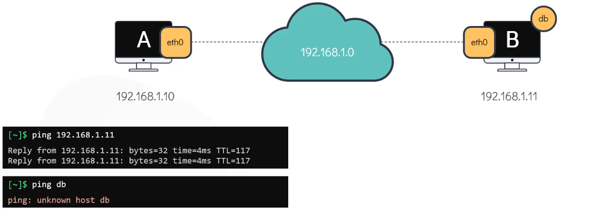
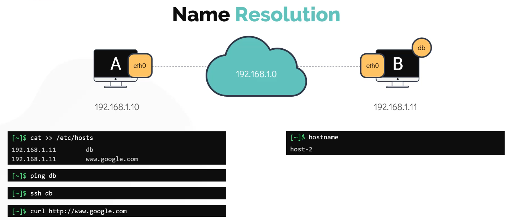
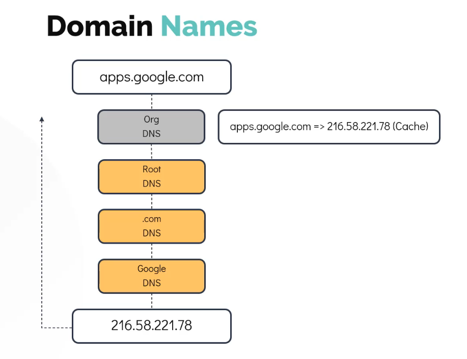

## DNS in Linux

2 system in same network can talk to each other

```bash
# ping system B from system A
$ ping 192.108.1.11
$ ping <website-name>

$ hostname # displays the hostname
```
#### instead of using ip addr if we want to resolve it using some name we need to use "name resolution". 


```bash
# Add a entry with the name to this file to use name resolutions
$ cat >> /etc/hosts

```
#### DNS Name system - it is separate system where all the ip and ip names are mainitained 

``` Note:
To setup DNS Resolution in your system you need to add ip addr of dns on your /etc/resolv.conf file
```
```bash
$ cat /etc/resolv.conf # to setup DNS name
$ ping db
$ cat >> /etc/hosts # to setup name resolution locally
$ ping test
```
Note: when you configure DNS and local name resolution at hosts file for single ip addr . The system first looks locally if the ip addr is find there it will take precendence and be used to resolve the ip addr.

This order is defined in /etc/nsswitch.conf file.


we can change the order by modifying this file.

#### Q. How can we resolve any name which is not in local hosts file or DNS even. something like external links www.google.com

Add the entry into /etc/resolv.conf file or set it up to forward any unknow request to google dns which have ip 8.8.8.8




#### Search domain

#### Record types

```bash
$ nslookup www.google.com
$ dig www.google.com
```