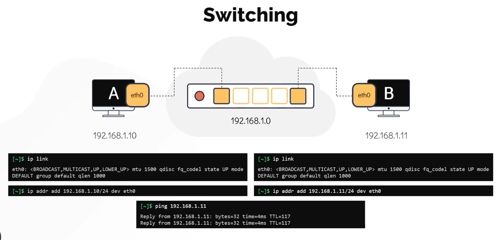
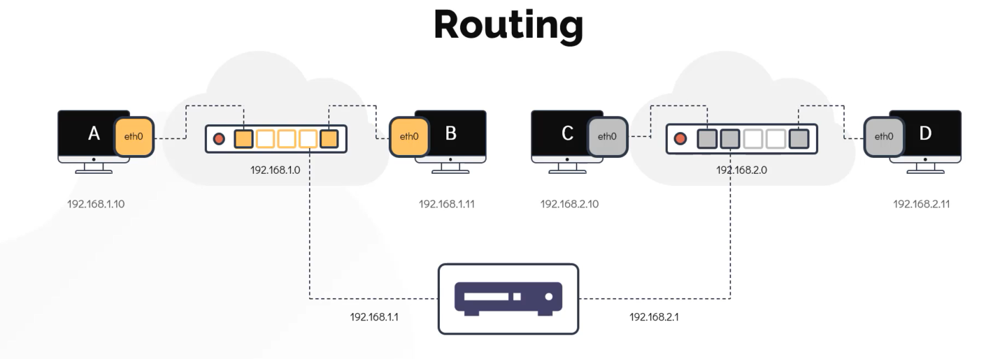
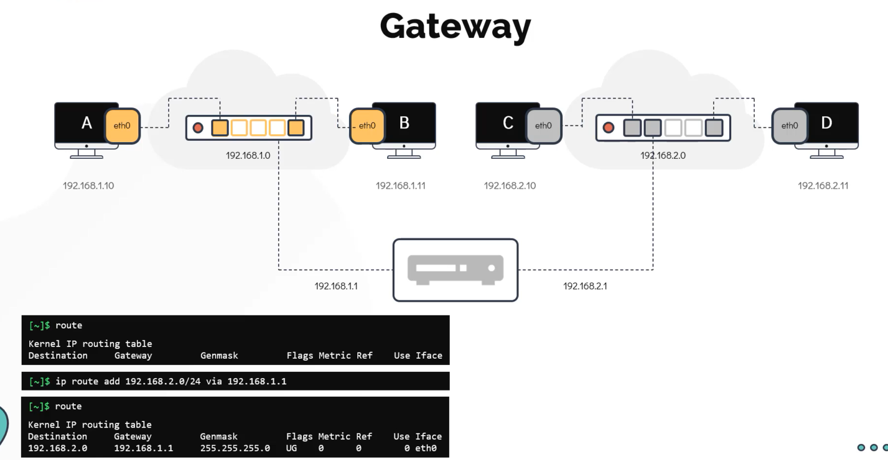
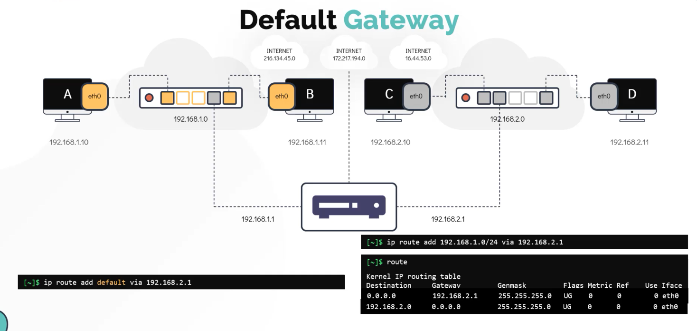

## Switching and Routing

#### Commands

2 computer connect to each other using switch and to connect to switch they need to have network interface on the device.
Switches enable communication within same network.
```bash
$ ip link # to check for nw interface

$ ip addr add 192.178.1.10/24 dev eth0 # assigning ip addr to the system
```


Routers help communicate systems within different networks.




#### Summary 
